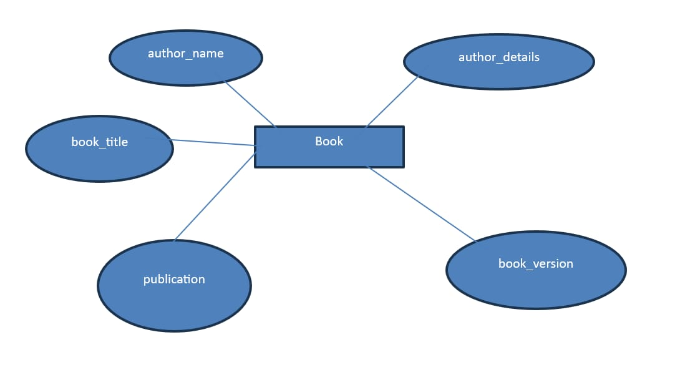

# Ex02 Django ORM Web Application
## Date: 06.03.2024

## AIM
To develop a Django application to store and retrieve data from a Book database using Object Relational Mapping(ORM).

## Entity relationship Diagram


## DESIGN STEPS
### STEP 1:
Clone the problem from GitHub

### STEP 2:
Create a new app in Django project

### STEP 3:
Enter the code for admin.py and models.py

### STEP 4:
Execute Django admin and create details for 10 books

## PROGRAM
```
admin.py

from django.contrib import admin
from .models import Book,BookAdmin
admin.site.register(Book,BookAdmin)

models.py

from django.db import models
from django.contrib import admin
class Book(models.Model):
        author_name=models.CharField(max_length=20);
        author_details=models.CharField(max_length=40);
        book_title=models.CharField(max_length=30);
        publication=models.DateField();
        book_version=models.IntegerField();
class BookAdmin(admin.ModelAdmin):
        list_display=("author_name","author_details","book_title","publication","book_version");

```


## OUTPUT


## RESULT
Thus the program for creating a database using ORM hass been executed successfully
